# laplacian-meshes

Please view this README rendered by GitHub at https://github.com/bmershon/laplacian-meshes

*All images, words, and code contained in this repository may be reproduced so long as the original author is given credit (Chris Tralie and Brooks Mershon).*

This assignment was completed as part of a course in 3D Digital Geometry (Math 290) taken at Duke University during Spring 2016. The course was taught by [Chris Tralie](http://www.ctralie.com/).

*LaplacianMesh.py* is the file students are responsible for editing. The rendering engine and GUI is provided by Chris Tralie.

## Introduction

This assignment revolves around the [Laplace operator](https://en.wikipedia.org/wiki/Laplace_operator). Here, the operator is realized as a big ol' matrix which, when multiplied (on the left) by the matrix holding the mesh's vertices, gives us the curvature at each vertex. There are two flavors of the **Laplacian matrix** used here: umbrella weighting and cotangent weighting. The latter method of weighting attempts to correct for the uneven resolution of the mesh. 

The following features have been implemented in this assignment:

- Laplacian mesh editing (Umbrella and Cotangent weights
- Color interpolation
- Smoothing and sharpening
- Minimal Surfaces
- Flattening and surface parameterization
- Texturing using UV coordinates

## [Laplacian Mesh Editing](http://www.ctralie.com/Teaching/COMPSCI290/Assignments/Group3_LaplacianMesh/#lapmesh)

### Laplacian Matrix

The Laplacian operator is encoded as a sparse matrix **L**, with anchor rows appended to encode the weights of the anchor vertices (which may be manually moved, hence the name Laplacian *editing*).

### Cotangent Weights

Rather than using equal weights for each neighboring vertex in the Laplacian operator, we can attempt to correct for irregular mesh resolutions by using [Cotangent Weights](http://www.ctralie.com/Teaching/COMPSCI290/Assignments/Group3_LaplacianMesh/).

*Homer's arms are raised by placing an anchor at a vertex on a finger tip that has been displaced vertically. A small handful of anchors placed symmetrically about his body help to restrict edits to his arms. Cotangent weighting is used here.*

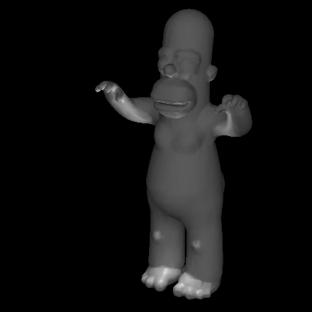

## [Color Interpolation](http://www.ctralie.com/Teaching/COMPSCI290/Assignments/Group3_LaplacianMesh/#function)

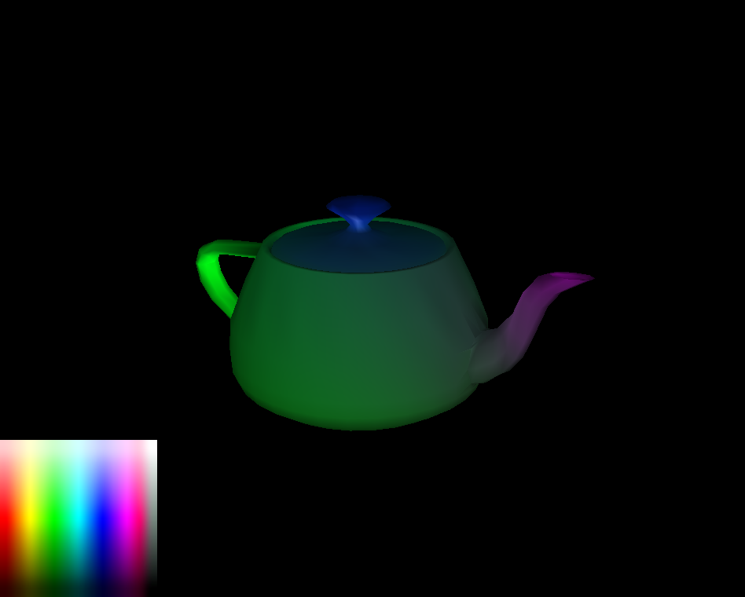

## [Laplacian Smoothing and Sharpening](http://www.ctralie.com/Teaching/COMPSCI290/Assignments/Group3_LaplacianMesh/#sharpening)

### Smoothing (Umbrella Weighting)

*We can smooth the teapot by iteratively pulling each vertex closer to the centroid of its neighbors. Iteratively smoothing the teapot will destroy small high-curvature features.*

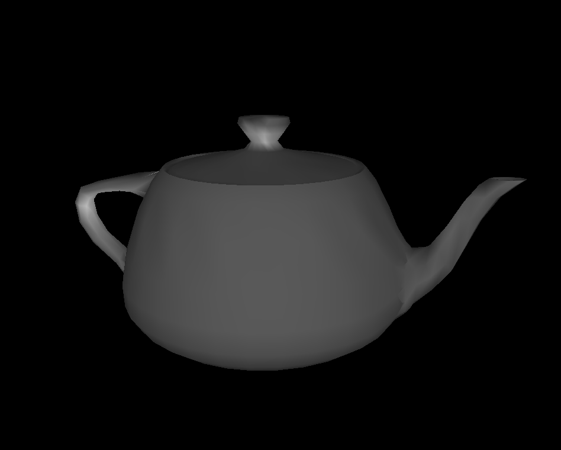

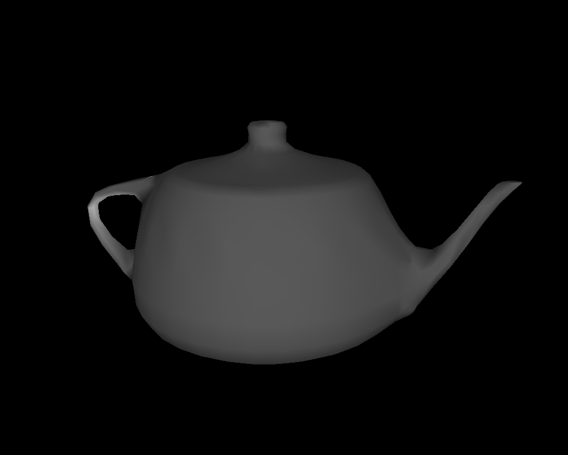

### Sharpening (Umbrella Weighting)

*We can sharpen the teapot by iteratively pulling each vertex farther away from the centroid of its neighbors. We notice that when we sharpen, we exacerbate the lower resolution modeling around the base of the teapot's spout. Self intersections can certainly occur by repeatedly sharpening the mesh.*

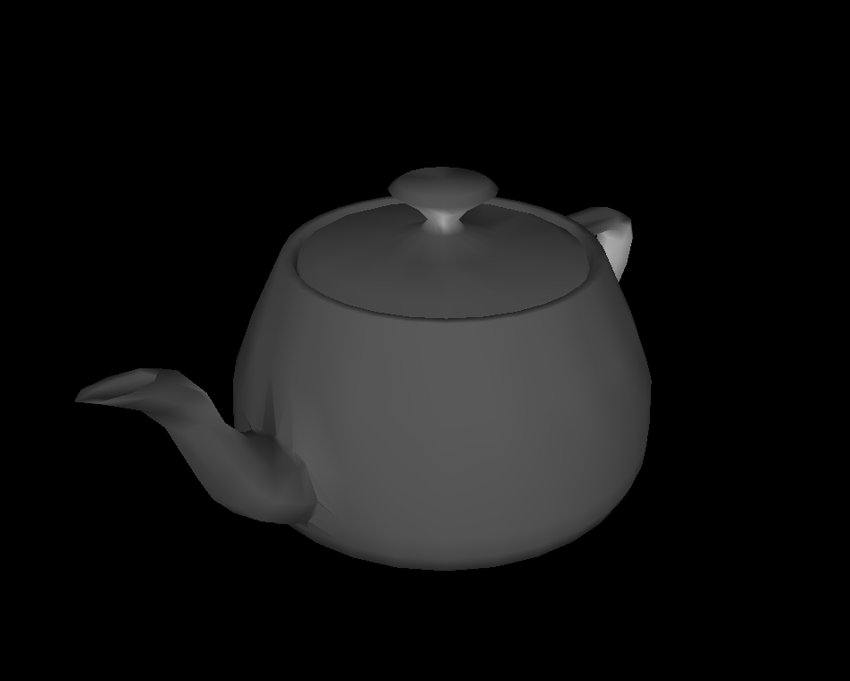
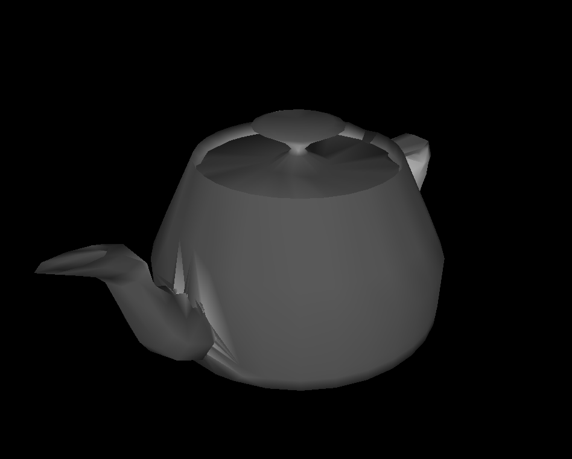

## [Minimal Surface](http://www.ctralie.com/Teaching/COMPSCI290/Assignments/Group3_LaplacianMesh/#membrane)

*The minimal surface preserves the topology of handle when six anchors are set in the teapot mesh.*

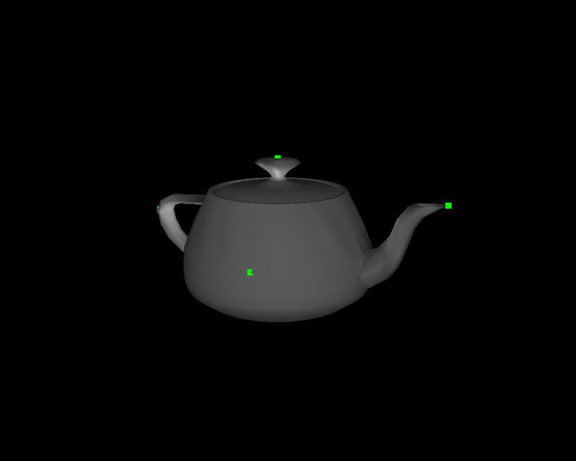
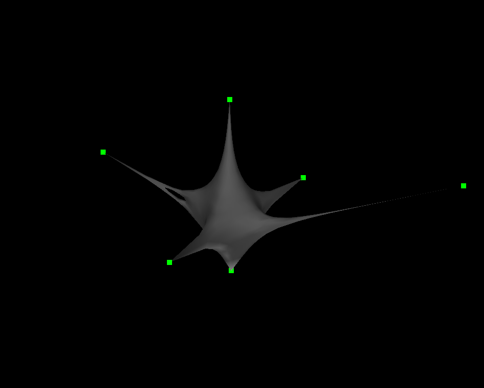

## [Mesh Parameterization (Flattening)](http://www.ctralie.com/Teaching/COMPSCI290/Assignments/Group3_LaplacianMesh/#flattening)

*A quadrilateral on the surface is chosen and its vertices are mapped to the unit square in the XY plane. The surface vertices are parameterized so that they lie inside of this unit square.*

> I'm a little teapot
short and flat.
There is my handle;
Where is my spout?

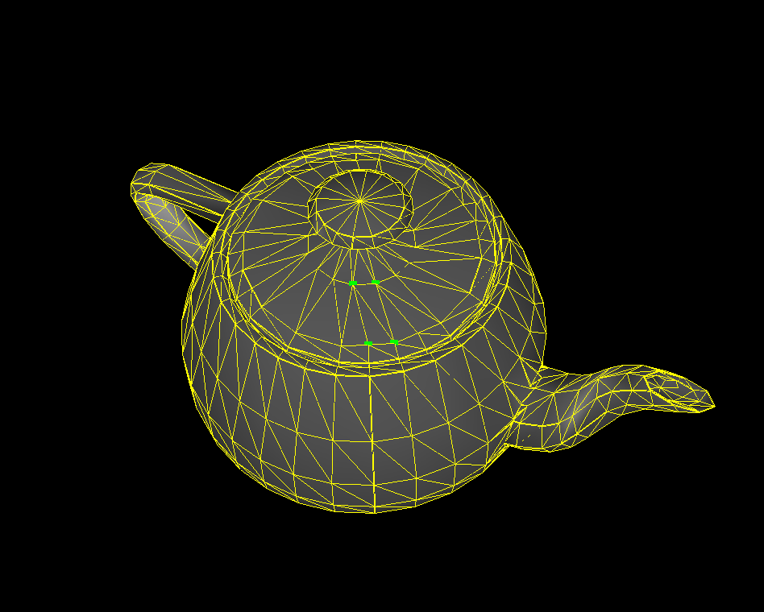
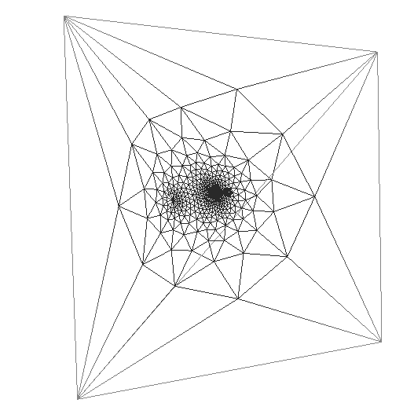

*Another example of flattening: Dragon gets squashed to the unit square.*

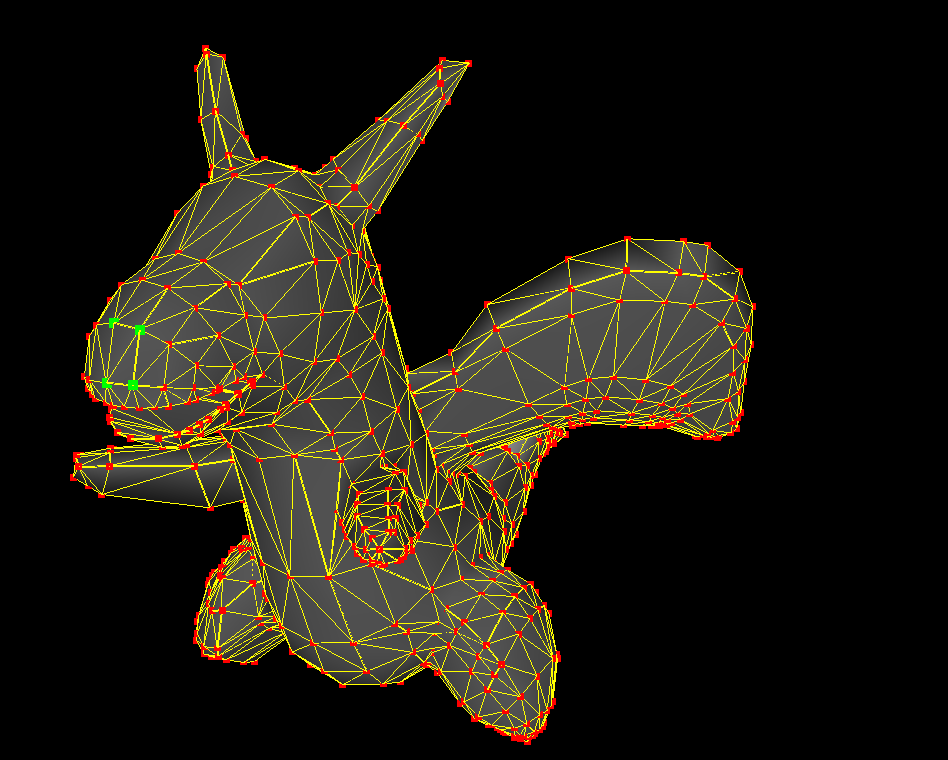
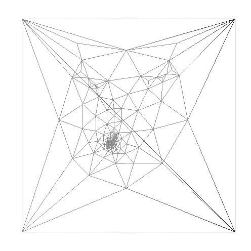

## [Texture Mapping (naive approach)](http://www.ctralie.com/Teaching/COMPSCI290/Assignments/Group3_LaplacianMesh/#texture)

Here, we apply a texture to a parameterization of the surface (UV Mapping). Unfortunately, by using the checkerboard texture, we see a lot of distortion that is not at all aesthetically pleasing. We observe this terrible distorition because the specified quadrilateral (green points) maps to a unit square, and all points "outside" of the mesh are squashed inside of this square. The mapping is certainly not conformal, and thus a straight-lined checkboard pattern is not going to produce an even checkboard patter across the entire mesh in most cases.

*Homer and the teapot are textured with the checkerboard.*

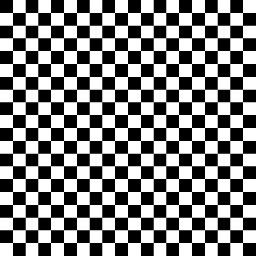
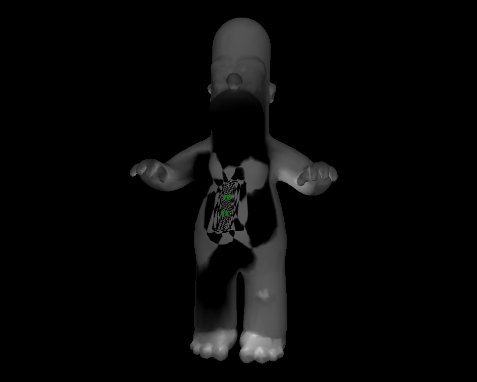
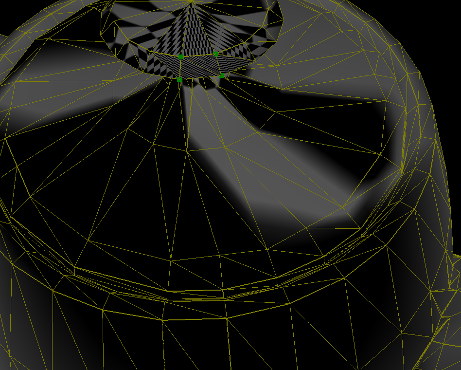

*[Keenan Crane's geometry processing framework](http://www.cs.cmu.edu/~kmcrane/Projects/DGPDEC/) based on discrete exterior calculus (DEC) presents a better solution for UV mapping textures to mesh models.*

## Bloopers (Art contest submission)

When you make a mistake in geometry processing, your mistakes can be beautiful.

*Homer experiences an unfortunate bug in the smoothing algorithm.*

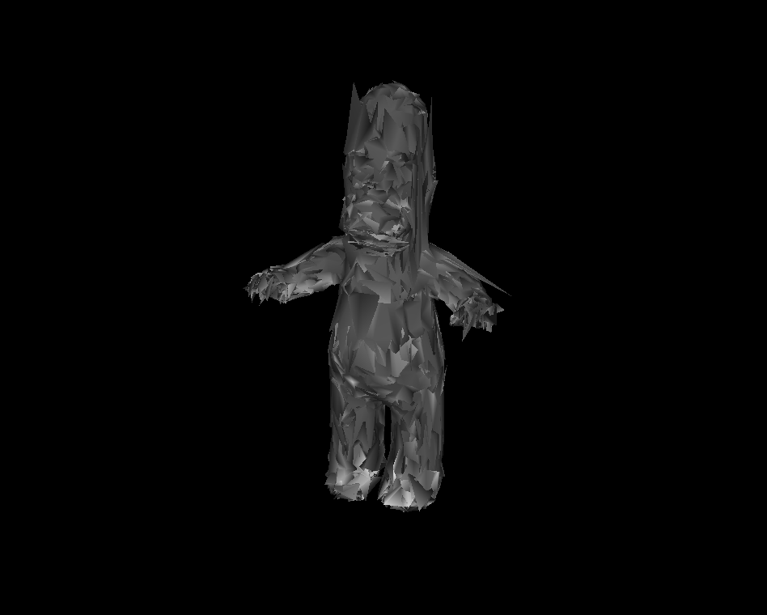
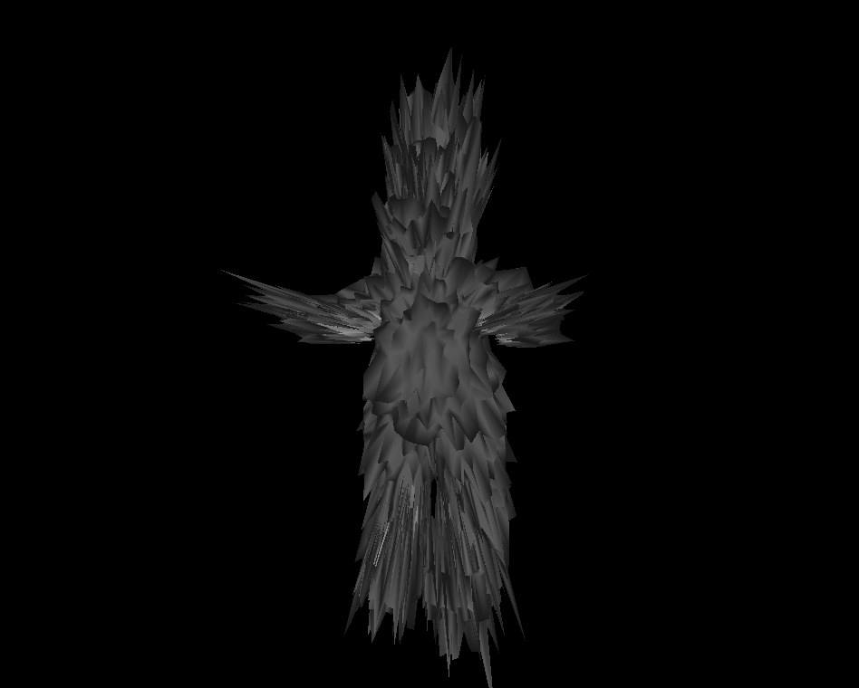
